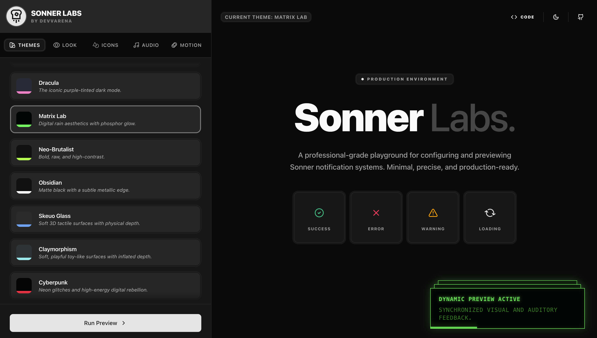

# Sonner Labs 🧊

**Sonner Labs** is a professional-grade playground and configurator for [Sonner](https://sonner.emilkowal.ski/), the opinionated toast component for React. It allows developers to visually design, preview, and export perfectly tailored notification systems in seconds.



## 🚀 Live Demo
Visit the live tool at: [sonnerlabs.devvarena.com](https://sonnerlabs.devvarena.com)

## ✨ Features

- **🎨 Advanced Theming**: Switch between curated presets or craft your own CSS-based themes.
- **👁️ Real-time Preview**: See exactly how your toasts will look and behave in a production-like environment.
- **🛠️ Granular Control**:
    - **Look & Feel**: Adjust border radius, colors, and toast sizes (sm to 2xl).
    - **Iconography**: Customize icons for every state (Success, Error, Info, etc.) and toggle icon visibility.
    - **Motion & Positioning**: Configure toaster position, duration, gap, and screen offset.
    - **Audio Feedback**: Add auditory cues with pop, success, and error sound presets.
- **💻 Instant Code Export**: Get ready-to-use React components and CSS snippets for your project.
- **🌗 Dark Mode**: Optimized for both light and dark interfaces.

## 🛠️ Tech Stack

- **Framework**: [Next.js 15+](https://nextjs.org/) (App Router)
- **Library**: [React 19](https://react.dev/)
- **Toasts**: [Sonner](https://sonner.emilkowal.ski/)
- **Styling**: [Tailwind CSS 4](https://tailwindcss.com/)
- **Components**: [Radix UI](https://www.radix-ui.com/) & [Shadcn UI](https://ui.shadcn.com/)
- **Icons**: [Lucide React](https://lucide.dev/) & [React Icons](https://react-icons.github.io/react-icons/)
- **Linter/Formatter**: [Biome](https://biomejs.dev/)

## 📦 Getting Started

### Prerequisites

- [Bun](https://bun.sh/) (recommended) or Node.js

### Installation

1. Clone the repository:
   ```bash
   git clone https://github.com/devyanshyadav/sonner-labs.git
   cd sonner-labs
   ```

2. Install dependencies:
   ```bash
   bun install
   ```

3. Run the development server:
   ```bash
   bun dev
   ```

4. Open [http://localhost:3000](http://localhost:3000) in your browser.


## 👤 Author

**Devyansh Yadav**
- Website: [devyanshyadav](https://devyanshyadav.com)
- Twitter: [@devyanshyadavv](https://x.com/DevyanshYadavv)

## 📄 License

This project is licensed under the MIT License.
